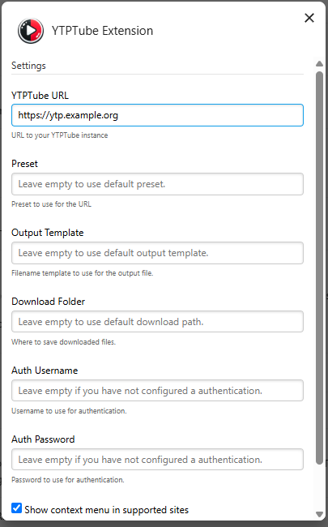

# A YTPTube extension

This extension can be used in `Chrome/Chromium browsers` and `Firefox` to add URLs to [YTPTube](https://github.com/arabcoders/ytptube) instance.

## Screenshots

 

## Installation from store

- Install from [Firefox]()
- Install from [Chrome]()

## Usage

Configure the extension to point to your YTPTube instance in addon preferences.
